# DriveSync - Multi-Host File Synchronization System

A comprehensive ASP.NET Core 9.0 application for synchronizing and managing files across multiple hosts with intelligent orchestration and conflict prevention.

## 🏗️ Architecture Overview

DriveSync is built on a consolidated architecture with two main components:

```
DriveSync/
├── Shared/           # Shared library with services and base classes
│   ├── Models/       # Data models and entities
│   ├── Services/     # Core business logic services
│   └── Data/         # Database context and configurations
├── WebUI/            # Main host application with Admin interface
│   ├── Controllers/  # MVC controllers for admin interface
│   ├── Views/        # Razor views for web interface
│   ├── BackgroundServices/  # All background service implementations
│   └── wwwroot/      # Static web assets
└── README.md         # This documentation
```

## 🎯 System Features

### Core Functionality
- **Multi-Host File Indexing**: Automatically scan and index files across multiple network hosts
- **Intelligent Host Orchestration**: Prevent conflicts between hosts using timezone-based scheduling
- **Database Synchronization**: Automatic sync between local and remote databases with disaster recovery
- **File Lifecycle Management**: Automatic deletion of inactive files based on configurable rules
- **Shared-to-Local Sync**: Synchronize files between shared network drives and local storage
- **Real-time Admin Dashboard**: Web-based interface for monitoring and managing all services

### Background Services
1. **FileIndexerBackgroundService**: Scans and indexes files from network drives
2. **DatabaseSyncBackgroundService**: Periodic database synchronization between local and remote
3. **DeleteInactiveFilesBackgroundService**: Removes inactive files based on retention policies
4. **SharedToLocalSyncBackgroundService**: Synchronizes files between shared and local drives

## 🛠️ Technical Stack

- **Framework**: ASP.NET Core 9.0
- **Database**: SQLite with Entity Framework Core
- **Architecture Pattern**: Background Services with Base Class inheritance
- **UI**: MVC with Bootstrap and real-time updates
- **Configuration**: JSON-based configuration with environment support
- **Logging**: Microsoft.Extensions.Logging with structured logging

## 📊 High-Level Design (HLD)


## 🔧 Low-Level Design (LLD)

### BaseBackgroundService Pattern
All background services inherit from `BaseBackgroundService` which provides:

```csharp
public abstract class BaseBackgroundService : BackgroundService
{
    // Automatic database sync on startup and shutdown
    protected abstract Task ExecuteServiceAsync(CancellationToken stoppingToken);
    
    // Database sync wrapper for all operations
    protected async Task ExecuteWithDatabaseSyncAsync(Func<Task> serviceOperation, string operationName)
    
    // Disaster recovery with try/catch/finally patterns
    private async Task PerformFinalDatabaseSyncAsync()
}
```

### Host Orchestration Algorithm
```
1. Check current UTC time
2. Convert to host-specific timezone
3. Calculate execution windows based on:
   - Host timezone offset
   - Service-specific buffer times
   - Conflict prevention rules
4. Allow/deny service execution
5. Log orchestration decisions
```

### Database Sync Flow
```
ON SERVICE START:
  1. Copy remote DB → local DB (preserve existing data)
  2. Initialize service with local DB
  3. Begin service operations

DURING OPERATION:
  1. All operations use local DB
  2. Periodic sync local DB → remote DB

ON SERVICE STOP:
  1. Final sync local DB → remote DB
  2. Cleanup local resources

ON ERROR:
  1. Disaster recovery sync
  2. Log error details
  3. Continue with graceful shutdown
```

## ⚙️ Host Configuration

### Supported Hosts
Configure multiple hosts in `appsettings.json`:

```json
{
  "FileIndexer": {
    "Hosts": {
      "HOME-DESKTOP": {
        "Enabled": true,
        "ScanIntervalMinutes": 20,
        "MaxFilesPerBatch": 1000,
        "Timezone": "Asia/Kolkata"
      },
      "LENOVO-LAPTOP": {
        "Enabled": true,
        "ScanIntervalMinutes": 20,
        "MaxFilesPerBatch": 1000,
        "Timezone": "Europe/Berlin"
      },
      "MI_HOME": {
        "Enabled": true,
        "ScanIntervalMinutes": 20,
        "MaxFilesPerBatch": 1000,
        "Timezone": "Europe/Berlin"
      }
    }
  }
}
```

### Host Orchestration Rules
- **Asia/Kolkata (UTC+5:30)**: Execution at minutes 0, 20, 40
- **Europe/Berlin (UTC+1/+2)**: Execution at minutes 8, 28, 48  
- **MI_HOME**: Execution at minutes 16, 36, 56
- **Buffer Time**: 5-minute buffer between host executions to prevent conflicts

## 🔄 Background Service Flow

```mermaid
sequenceDiagram
    participant APP as Application Start
    participant BS as BaseBackgroundService
    participant HO as HostOrchestration
    participant DB as DatabaseCopyService
    participant SVC as Service Logic
    
    APP->>BS: Start Background Service
    BS->>DB: Copy Remote DB → Local DB
    BS->>SVC: Initialize Service
    
    loop Service Execution Loop
        BS->>HO: Can Service Start Now?
        alt Host Schedule Allows
            HO->>BS: Yes - Proceed
            BS->>SVC: Execute Service Operation
            SVC->>DB: Work with Local DB
            BS->>DB: Sync Local DB → Remote DB
        else Host Schedule Prevents
            HO->>BS: No - Wait
            BS->>BS: Delay Execution
        end
    end
    
    APP->>BS: Stop Signal
    BS->>DB: Final Sync Local DB → Remote DB
    BS->>SVC: Cleanup Resources
```



## 🎮 Use Case Diagram


## 🚀 Getting Started

### Prerequisites
- .NET 9.0 SDK
- Network access to shared drives
- Write permissions to database location

### Configuration
1. Update `WebUI/appsettings.json`:
   ```json
   {
     "InputFolder": "\\\\your-network-path\\",
     "DatabaseConfig": {
       "DatabasePath": "C:\\YourPath\\DriveSyncService.db",
       "LocalDatabasePath": "fileindexer_local.db"
     }
   }
   ```

2. Configure host-specific settings for your environment

### Running the Application
```bash
# Build the solution
dotnet build

# Run the WebUI application
dotnet run --project WebUI

# Access admin interface
https://localhost:5044
```

### Service Intervals
- **File Indexing**: 20 minutes (configurable per host)
- **Database Sync**: 5 minutes
- **Delete Inactive Files**: 15 minutes  
- **Shared to Local Sync**: 5 minutes

## 📱 Admin Interface Features

- **Real-time Dashboard**: Live status of all hosts and services
- **Host Management**: View and manage host configurations
- **Service Monitoring**: Track background service execution
- **Database Status**: Monitor database sync operations
- **Log Viewing**: Access structured service logs
- **Configuration Management**: Update settings without restart

## 🛡️ Error Handling & Recovery

### Database Disaster Recovery
- Automatic backup before operations
- Try/catch/finally patterns in all services
- Graceful degradation on network failures
- Automatic retry mechanisms with exponential backoff

### Host Conflict Prevention
- Timezone-aware scheduling
- Execution window validation
- Service priority management
- Automatic delay and retry logic

### Service Resilience
- Individual service failure isolation
- Continue-on-error patterns for non-critical operations
- Comprehensive logging for troubleshooting
- Health check endpoints for monitoring

## 📈 Performance & Scalability

### Optimization Features
- Batch processing for large file sets
- Configurable batch sizes per host
- Memory-efficient file enumeration
- Database connection pooling
- Asynchronous operation patterns

### Monitoring & Metrics
- Structured logging with correlation IDs
- Performance counters for file operations
- Database operation timing
- Network I/O monitoring
- Service execution statistics

## 🔐 Security Considerations

- Network drive access validation
- Database file protection
- Service account permissions
- Admin interface authentication ready
- Audit trail for all operations

## 📄 License

This project is proprietary software. All rights reserved.

---

**Version**: 2.0  
**Last Updated**: October 2025  
**Architecture**: Consolidated Background Services with BaseBackgroundService Pattern